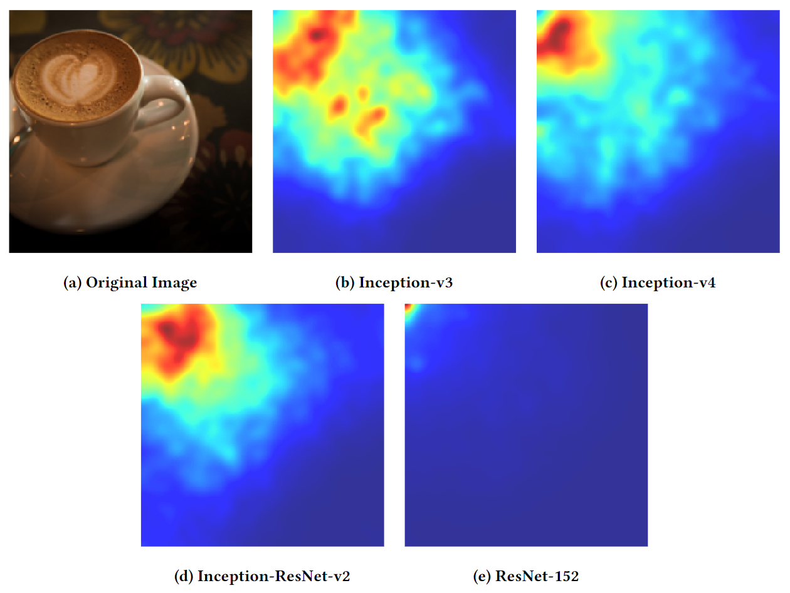

<div align="center">

# Improving Adversarial Transferability via Frequency-based Stationary Point Search

[](https://opensource.org/licenses/MIT)
[](https://uobevents.eventsair.com/cikm2023/)

</div>

This Github repository is the paper [Improving Adversarial Transferability via Frequency-based Stationary Point Search](https://dl.acm.org/doi/abs/10.1145/3583780.3614927) implementation code.

<table align="center">
  <tr>
    <td align="center"> 
       
      <br>
      <em style="font-size: 18px;">  <strong style="font-size: 18px;">Figure 1:</strong> Frequency-based attack visualization results for different models.</em>
    </td>
  </tr>
</table>

# Abstract
Deep neural networks (DNNs) have been shown vulnerable to interference from adversarial samples, leading to erroneous predictions. Investigating adversarial attacks can effectively improve the reliability as well as the performance of deep neural models in real-world applications. Since it is generally challenging to infer the parameters in black-box models, high transferability becomes an important factor for the success rate of an attack method. Recently, the Spectrum Simulation Attack method exhibits promising results based on the frequency domain. In light of SSA, we propose a novel attack approach in this paper, which achieves the best results among diverse state-of-the-art transferable adversarial attack methods. Our method aims to find a stationary point, which extends the ability to find multiple local optima with the optimal local attack effect. After finding the stationary point, a frequency-based search is employed to explore the best adversarial samples in the neighbouring space, utilmately determining the final adversarial direction. We compare our method against a variety of cutting-edge transferable adversarial methods. Extensive experiments validate that our method improves the attack success rate by 4.7% for conventionally trained models and 53.1% for adversarially trained models.

# Installation and Setup

## Requirements
- python 3.8.10
- pytorch 1.13.1
- torchvision 0.14.1
- pretrainedmodels 0.7.0
- numpy 1.21.3
- tqdm 4.63.1


## Setup
The implementation necessitates the acquisition of pretrained models, integral to evaluating the adversarial robustness and transferability. Download and place the following models within the `models` directory:

Model  | Download Link
------------- | -------------
Inception V3  | [tf2torch_inception_v3](https://github.com/ylhz/tf_to_pytorch_model/releases/download/v1.0/tf2torch_inception_v3.npy)
Inception V4| [tf2torch_inception_v4](https://github.com/ylhz/tf_to_pytorch_model/releases/download/v1.0/tf2torch_inception_v4.npy)
Inception-ResNet-v2  | [tf2torch_resnet_v2_152](https://github.com/ylhz/tf_to_pytorch_model/releases/download/v1.0/tf2torch_inc_res_v2.npy)
ResNet V2 152  | [tf2torch_resnet_v2_152](https://github.com/ylhz/tf_to_pytorch_model/releases/download/v1.0/tf2torch_resnet_v2_152.npy)
Inception v3 adv | [tf2torch_adv_inception_v3](https://github.com/ylhz/tf_to_pytorch_model/releases/download/v1.0/tf2torch_adv_inception_v3.npy)
Inception ResNet v2 adv  | [adv_inception_resnet_v2_2017_12_18.tar.gz](http://download.tensorflow.org/models/adv_inception_resnet_v2_2017_12_18.tar.gz)
Inception v3 adv ens3  | [tf2torch_ens3_adv_inc_v3](https://github.com/ylhz/tf_to_pytorch_model/releases/download/v1.0/tf2torch_ens3_adv_inc_v3.npy)
Inception v3 adv ens4  | [tf2torch_ens4_adv_inc_v3](https://github.com/ylhz/tf_to_pytorch_model/releases/download/v1.0/tf2torch_ens4_adv_inc_v3.npy)
Inception ResNet v2 adv ens3  | [tf2torch_ens_adv_inc_res_v2](https://github.com/ylhz/tf_to_pytorch_model/releases/download/v1.0/tf2torch_ens_adv_inc_res_v2.npy)


The models in the table above are from [here](https://github.com/ylhz/tf_to_pytorch_model). These models need to be downloaded and placed under the `models` dir.

# Execution Guidelines
To execute the FSPS attack methodology and assess its efficacy in generating transferable adversarial examples, utilize the following command structure:
- FSPS
```bash
CUDA_VISIBLE_DEVICES=0 python attack-FSPS.py --output_dir outputs_temp --method TI --num_images 1000 --model inceptionv3
```
```bash
CUDA_VISIBLE_DEVICES=0 python attack-FSPS.py --output_dir outputs_temp --method TI --num_images 1000 --model inceptionv4
```
```bash
CUDA_VISIBLE_DEVICES=0 python attack-FSPS.py --output_dir outputs_temp --method TI --num_images 1000 --model inceptionresnetv2
```
```bash
CUDA_VISIBLE_DEVICES=0 python attack-FSPS.py --output_dir outputs_temp --method TI --num_images 1000 --model resnet152
```
- SSA

```bash
CUDA_VISIBLE_DEVICES=0 python attack-SSA.py --output_dir outputs_temp --method DITIMI --num_images 1000 --model inceptionv3
```

- Baseline

```bash
CUDA_VISIBLE_DEVICES=0 python attack-baseline.py --output_dir outputs_temp --method DI --num_images 1000 --model inceptionv3
```


- verify

```bash
CUDA_VISIBLE_DEVICES=0 python verify.py --method baseline_result_DI-v3 --output_dir outputs_temp/ --num_images 1000 --output_csv result.csv
```
# Citing FSPS
If you utilize this implementation or the FSPS methodology in your research, please cite the following paper:

```
@inproceedings{zhu2023improving,
  title={Improving adversarial transferability via frequency-based stationary point search},
  author={Zhu, Zhiyu and Chen, Huaming and Zhang, Jiayu and Wang, Xinyi and Jin, Zhibo and Lu, Qinghua and Shen, Jun and Choo, Kim-Kwang Raymond},
  booktitle={Proceedings of the 32nd ACM International Conference on Information and Knowledge Management},
  pages={3626--3635},
  year={2023}
}
```

# Acknowledgments
We extend our gratitude to the contributors and researchers whose insights and efforts have been instrumental in the development of the FSPS methodology.

For further information or inquiries, please refer to the corresponding author(s) of the FSPS paper or initiate a discussion in this repository's Issues section.

# Reference
Code refer to: [SSA](https://github.com/yuyang-long/SSA)
